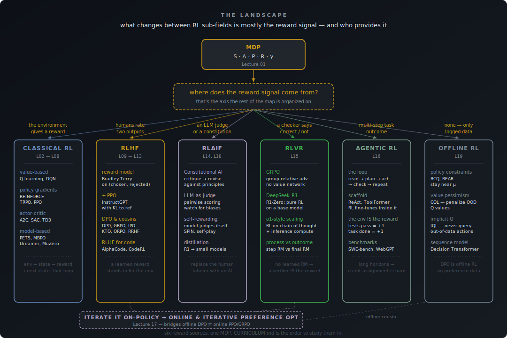

# Study Reinforcement Learning

Notes, lectures, and exercises for learning reinforcement learning and how it's used to train language models, from MDPs and policy gradients through RLHF, DPO, and GRPO.

This is a personal study repo, not a library. It mixes notes a person wrote (some going back to a 2017 Berkeley course) with a newer lecture series that hasn't been reviewed yet. Every doc under `notes/` and `reference/` says at the top whether it's `hand-written`, `reviewed`, or `unreviewed`. See [`AGENTS.md`](./AGENTS.md) for how the repo is organized and how to work in it, with a coding agent or solo.

## What's here

**Trusted, hand-written:**

- **[`notes/cs294-2017/`](./notes/cs294-2017/)**: personal student notes from CS 294 Deep RL (Berkeley, Spring 2017; Levine, Schulman, Finn). 246 lines of real-time notes from the field being built. Idiosyncratic, opinionated, with the cannon-trajectory aside. Kept as written.
- **[`notes/sutton-barto-digest/`](./notes/sutton-barto-digest/)**: short distillation of the four elements of an RL system, from Sutton & Barto.
- **Talks, books, courses**: the curated external links below. The Pineau intro, Abbeel's deep RL talk, David Silver's UCL course, Sutton & Barto's book, CS285, Spinning Up. Here since 2015. Still the best place to start if you're new.
- **[`exercises/`](./exercises/)**: five small coding exercises with `pytest` tests and reference solutions, verified to pass. Implement REINFORCE on CartPole, Q-learning on FrozenLake, value iteration on a gridworld, actor-critic, a tiny GRPO loop on a verifiable arithmetic task.

**AI-drafted, useful as scaffold (`unreviewed`, treat with skepticism):**

- **[`notes/lectures/`](./notes/lectures/)**: a 34-lecture series, MDPs through RLHF / DPO / GRPO / RLVR / agentic / offline. Editorial pass done (broken links, code bugs, made-up citations all caught and fixed), but no person has read each one end-to-end. Cross-check the math against the cited papers before relying on it. Index and per-lecture status in [`notes/README.md`](./notes/README.md); ordered study path in [`CURRICULUM.md`](./CURRICULUM.md).
- **`notes/cheat-sheets/`, `notes/diagrams/`**: quick reference. Same caveat. (The diagrams file caught and fixed two wrong loss diagrams during the audit, FWIW.)
- **[`reference/papers/`](./reference/papers/)**: auto-collected paper lists from arXiv (~430 abstracts). Use as a search index, not a curated reading list.
- **[`tools/`](./tools/)**: `arxiv-collector/` (fetches arXiv papers), `lit-builder/` (ICLR/NeurIPS/ICML triage with keyword filter + LLM scoring), `content-pipeline/` (drafts blog posts from papers; auxiliary).

[`AGENTS.md`](./AGENTS.md) explains the `<!-- status: hand-written | reviewed | unreviewed -->` convention every doc carries.

## Start here

- **New to RL?** Start with the talks/books/courses below: Pineau's intro, then Sutton & Barto for foundations, then David Silver's UCL course or CS285 (Berkeley's current version of CS294). The 2017 CS294 notes ([`notes/cs294-2017/`](./notes/cs294-2017/)) give you one student's working notes through the same material if you like that genre.
- **Want hands-on?** Do the [`exercises/`](./exercises/). They're tested and they actually run. Five of them, a couple of hours each.
- **Curious about modern LLM RL?** The 34-lecture series in [`notes/lectures/`](./notes/lectures/) covers RLHF, DPO, GRPO, RLVR, agentic, offline. Drafts; cross-check the claims against the cited papers.
- **Working in this repo with Claude Code or Codex?** Read [`AGENTS.md`](./AGENTS.md) first.

## The landscape

Everything in the lecture series is the same underlying object: an MDP, where an agent picks actions and some signal tells it whether things are going well. What changes between sub-fields is mostly *what that signal is* and *who provides it*. Classical RL gets a reward from the environment. RLHF infers a reward from human preference labels. RLAIF replaces the human with an LLM judge or a written constitution. RLVR skips the learned reward model entirely and uses a verifier: a checker for math, a test suite for code. Agentic RL puts the model in a multi-turn loop with an environment that tells it whether the task ultimately succeeded. Offline RL works from logged data only, no fresh interaction.

The map below shows where each family fits. The lectures fill in the details; [`CURRICULUM.md`](./CURRICULUM.md) is the suggested order.



---

## Talks to start with

* [Introduction to Reinforcement Learning](http://videolectures.net/deeplearning2016_pineau_reinforcement_learning/) by Joelle Pineau, McGill University:
	* Applications of RL.
	* When to use RL?
	* RL vs supervised learning
	* What is MDP? Markov Decision Process
	* Components of an RL agent:
		- states
		- actions (Probabilistic effects)
		- Reward function
		- Initial state distribution
			```
			                             +-----------------+
			      +--------------------- |                 |
			      |                      |      Agent      |
			      |                      |                 | +---------------------+
			      |         +----------> |                 |                       |
			      |         |            +-----------------+                       |
			      |         |                                                      |
			state |         | reward                                               | action
			S(t)  |         | r(t)                                                 | a(t)
			      |         |                                                      |
			      |         | +                                                    |
			      |         | |  r(t+1) +----------------------------+             |
			      |         +-----------+                            |             |
			      |           |         |                            | <-----------+
			      |           |         |      Environment           |
			      |           |  S(t+1) |                            |
			      +---------------------+                            |
			                  |         +----------------------------+
			                  +

			* Sutton and Barto (1998)

			```

	* Explanation of the Markov Property:
	* Why Maximizing utility in:
		- Episodic tasks
		- Continuing tasks
			+ The discount factor, gamma γ
	* What is the policy & what to do with it?
		- A policy defines the action-selection strategy at every state:
	* Value functions:
		- The value of a policy equations are (two forms of) Bellman’s equation.
		- (This is a dynamic programming algorithm).
		- Iterative Policy Evaluation:
			+ Main idea: turn Bellman equations into update rules.
	* Optimal policies and optimal value functions.
		* Finding a good policy: Policy Iteration (Check the talk Below By Peter Abeel)
		* Finding a good policy: Value iteration
			- Asynchronous value iteration:
			- Instead of updating all states on every iteration, focus on important states.
	* Key challenges in RL:
		- Designing the problem domain
			- State representation
			– Action choice
			– Cost/reward signal
		- Acquiring data for training
			– Exploration / exploitation
			– High cost actions
			– Time-delayed cost/reward signal
		- Function approximation
		- Validation / confidence measures
	* The RL lingo.
	* In large state spaces: Need approximation:
		- Fitted Q-iteration:
			+ Use supervised learning to estimate the Q-function from a batch of training data:
			+ Input, Output and Loss.
				* i.e: The Arcade Learning Environment
	* Deep Q-network (DQN) and tips.

* [Deep Reinforcement Learning](http://videolectures.net/deeplearning2016_abbeel_deep_reinforcement/) by Pieter Abbeel, EE & CS, UC Berkeley
	- Why Policy Optimization?
	- Cross Entropy Method (CEM) / Finite Differences / Fixing Random Seed
	- Likelihood Ratio (LR) Policy Gradient
	- Natural Gradient / Trust Regions (-> TRPO)
	- Actor-Critic (-> GAE, A3C)
	- Path Derivatives (PD) (-> DPG, DDPG, SVG)
	- Stochastic Computation Graphs (generalizes LR / PD)
	- Guided Policy Search (GPS)
	- Inverse Reinforcement Learning
		+ Inverse RL vs. behavioral cloning

	- Explanation with Implementation for some of the topics mentioned in the Deep Reinforcement Learning talk, written by [Arthur Juliani](https://github.com/awjuliani)
		* The TF / Python implementations [can be found here](https://github.com/awjuliani/DeepRL-Agents).
		* [Part 0 — Q-Learning Agents](https://medium.com/emergent-future/simple-reinforcement-learning-with-tensorflow-part-0-q-learning-with-tables-and-neural-networks-d195264329d0#.kghmcex46)
		* [Part 1 — Two-Armed Bandit](https://medium.com/@awjuliani/super-simple-reinforcement-learning-tutorial-part-1-fd544fab149#.bqvzsrvh7)
		* [Part 1.5 — Contextual Bandits](https://medium.com/emergent-future/simple-reinforcement-learning-with-tensorflow-part-1-5-contextual-bandits-bff01d1aad9c#.h2c63t3om)
		* [Part 2 — Policy-Based Agents](https://medium.com/@awjuliani/super-simple-reinforcement-learning-tutorial-part-2-ded33892c724#.v0hnvh4tw)
		* [Part 3 — Model-Based RL](https://medium.com/@awjuliani/simple-reinforcement-learning-with-tensorflow-part-3-model-based-rl-9a6fe0cce99#.i8pgqg8xa)
		* [Part 4 — Deep Q-Networks and Beyond](https://medium.com/@awjuliani/simple-reinforcement-learning-with-tensorflow-part-4-deep-q-networks-and-beyond-8438a3e2b8df#.qecef59on)
		* [Part 5 — Visualizing an Agent’s Thoughts and Actions](https://medium.com/@awjuliani/simple-reinforcement-learning-with-tensorflow-part-5-visualizing-an-agents-thoughts-and-actions-4f27b134bb2a#.60nyejzep)
		* [Part 6 — Partial Observability and Deep Recurrent Q-Networks](https://medium.com/emergent-future/simple-reinforcement-learning-with-tensorflow-part-6-partial-observability-and-deep-recurrent-q-68463e9aeefc#.w22xh551q)
		* [Part 7 — Action-Selection Strategies for Exploration](https://medium.com/emergent-future/simple-reinforcement-learning-with-tensorflow-part-7-action-selection-strategies-for-exploration-d3a97b7cceaf#.vxsnvalt7)
		* [Part 8 — Asynchronous Actor-Critic Agents (A3C)](https://medium.com/emergent-future/simple-reinforcement-learning-with-tensorflow-part-8-asynchronous-actor-critic-agents-a3c-c88f72a5e9f2#.9nns6digz)

## Books

- A short overview of Deep RL by Yuxi Li: [Deep Reinforcement Learning: An Overview](https://arxiv.org/abs/1701.07274v2)
- [Reinforcement Learning: An Introduction by Richard S. Sutton and Andrew G. Barto](http://incompleteideas.net/book/the-book.html)
- [Algorithms for Reinforcement Learning](https://sites.ualberta.ca/~szepesva/papers/RLAlgsInMDPs.pdf) (Szepesvári)
- [Reinforcement Learning and Dynamic Programming using Function Approximators](https://orbi.uliege.be/bitstream/2268/27963/1/book-FA-RL-DP.pdf) (Buşoniu et al.)

## Courses

* [Reinforcement Learning](https://www.davidsilver.uk/teaching/) by David Silver (UCL):
	* Lecture 1: Introduction to Reinforcement Learning
	* Lecture 2: Markov Decision Processes
	* Lecture 3: Planning by Dynamic Programming
	* Lecture 4: Model-Free Prediction
	* Lecture 5: Model-Free Control
	* Lecture 6: Value Function Approximation
	* Lecture 7: Policy Gradient Methods
	* Lecture 8: Integrating Learning and Planning
	* Lecture 9: Exploration and Exploitation
	* Lecture 10: Case Study: RL in Classic Games

* [CS 294: Deep Reinforcement Learning, Spring 2017](https://rll.berkeley.edu/deeprlcourse-fa17/) by Sergey Levine, John Schulman, Chelsea Finn. My notes from taking it are at [`notes/cs294-2017/`](./notes/cs294-2017/).

* [CS 285: Deep Reinforcement Learning (Berkeley)](https://rail.eecs.berkeley.edu/deeprlcourse/), the current version of CS294, updated each year.

* [Deep RL Course (Hugging Face)](https://huggingface.co/learn/deep-rl-course/unit0/introduction). Hands-on, uses current tooling.

* [Spinning Up in Deep RL (OpenAI)](https://spinningup.openai.com/). Explanations plus reference implementations.

## Some landmark papers in RL for LLMs

(With identifiers so you can check them. The lecture series goes into these.)

* AlphaCode: *Competition-level code generation with AlphaCode*, Li et al., Science 2022. [arXiv:2203.07814](https://arxiv.org/abs/2203.07814)
* CodeRL: *CodeRL: Mastering Code Generation through Pretrained Models and Deep Reinforcement Learning*, Le et al., NeurIPS 2022. [arXiv:2207.01780](https://arxiv.org/abs/2207.01780)
* InstructGPT: *Training language models to follow instructions with human feedback*, Ouyang et al., 2022. [arXiv:2203.02155](https://arxiv.org/abs/2203.02155)
* DPO: *Direct Preference Optimization: Your Language Model is Secretly a Reward Model*, Rafailov et al., 2023. [arXiv:2305.18290](https://arxiv.org/abs/2305.18290)
* DeepSeek-R1: *DeepSeek-R1: Incentivizing Reasoning Capability in LLMs via Reinforcement Learning*, DeepSeek-AI, 2025. [arXiv:2501.12948](https://arxiv.org/abs/2501.12948)

More, organized by topic, in [`reference/papers/`](./reference/papers/).

## Communities

* [r/reinforcementlearning](https://www.reddit.com/r/reinforcementlearning/)
* [Papers with Code: Reinforcement Learning](https://paperswithcode.com/area/reinforcement-learning)
* [Hugging Face: RL](https://huggingface.co/learn/deep-rl-course)

---

## Contributing

Suggestions and corrections welcome via issues or pull requests. If you fix an error in an unreviewed lecture, note what was wrong. That's the most useful kind of contribution here.

## License


Licensed under [Creative Commons Attribution-NonCommercial-NoDerivs 3.0 Unported](./license.md).
