# RL Algorithm Diagrams Collection

> **Visual Learning Guide**: Intuitive diagrams for every major RL algorithm, ready for presentations

**How to use**:
1. Copy Mermaid code to [Mermaid Live Editor](https://mermaid.live)
2. Export as SVG/PNG
3. Import to DrawIO for animations
4. Follow animation notes for each diagram

---

## Table of Contents

1. [MDP Flow](#1-mdp-flow)
2. [Bellman Backup](#2-bellman-backup)
3. [Policy Iteration Loop](#3-policy-iteration-loop)
4. [REINFORCE Algorithm](#4-reinforce-algorithm)
5. [Actor-Critic Architecture](#5-actor-critic)
6. [PPO Training Pipeline](#6-ppo-pipeline)
7. [RLHF Full Pipeline](#7-rlhf-pipeline)
8. [DPO vs PPO Comparison](#8-dpo-vs-ppo)
9. [GRPO Sampling & Ranking](#9-grpo-sampling)
10. [Reward Model Training](#10-reward-model)
11. [LLM Alignment Timeline](#11-alignment-timeline)
12. [Method Decision Tree](#12-decision-tree)

---

## 1. MDP Flow

**Purpose**: Show the agent-environment interaction loop

**Animation notes**:
- Animate state → agent → action cycle
- Highlight reward feedback loop
- Show how observations flow


**DrawIO Animation Sequence**:
1. Pulse State box (1s)
2. Arrow: State → Observe (0.5s)
3. Pulse Policy (1s)
4. Arrow: Policy → Action (0.5s)
5. Pulse Action → State' (1s)
6. Split: State' → Reward + next State (1s)
7. Loop back with fade

---

## 2. Bellman Backup

**Purpose**: Visualize the recursive value relationship

**Animation notes**:
- Show "backup" flowing from future to present
- Highlight discount factor γ effect

```mermaid
graph LR
    subgraph Current
        V[V(s)]
        R1[r]
    end

    subgraph Next_State
        V'[V(s')]
        G[γ × V(s')]
    end

    subgraph Bellman_Update
        EQ["V(s) = r + γV(s')"]
    end

    R1 -->|immediate| EQ
    V' -->|discounted| G
    G -->|future value| EQ
    EQ -->|update| V

    style V fill:#ffe1e1
    style V' fill:#e1ffe1
    style EQ fill:#fff5e1
    style G fill:#e1e1ff
```

**DrawIO Animation**:
1. Highlight r (immediate reward)
2. Show V(s') in next state
3. Apply discount γ (shrink or fade V(s'))
4. Combine r + γV(s')
5. Flow into V(s) update

---

## 3. Policy Iteration Loop

**Purpose**: Show the two-step alternating process

**Animation notes**:
- Bounce between evaluation and improvement
- Show convergence

```mermaid
graph TB
    Start([Initialize Random Policy π])

    subgraph Policy_Evaluation
        PE1[Start with current policy π]
        PE2[Compute V^π using Bellman]
        PE3[Iterate until convergence]
    end

    subgraph Policy_Improvement
        PI1[For each state s]
        PI2["π'(s) = argmax Q^π(s,a)"]
        PI3[New policy π']
    end

    Check{π' = π?}
    Done([Optimal Policy! 🎉])

    Start --> PE1
    PE1 --> PE2
    PE2 --> PE3
    PE3 --> PI1
    PI1 --> PI2
    PI2 --> PI3
    PI3 --> Check
    Check -->|No| PE1
    Check -->|Yes| Done

    style Start fill:#e1f5ff
    style Done fill:#e1ffe1
    style Policy_Evaluation fill:#ffe1e1,stroke:#ff0000
    style Policy_Improvement fill:#e1e1ff,stroke:#0000ff
```



**DrawIO Animation**:
1. Start at Initialize
2. Pulse Policy Evaluation box (2s)
3. Show Bellman iterations (loop 3x fast)
4. Transition to Policy Improvement
5. Pulse Improvement box (2s)
6. Check convergence diamond
7. Loop or proceed to Done

---

## 4. REINFORCE Algorithm

**Purpose**: Show policy gradient Monte Carlo approach

**Animation notes**:
- Highlight trajectory rollout
- Show gradient computation
- Emphasize "make good actions more likely"

```mermaid
graph TB
    subgraph Rollout
        S0[s_0] --> A0[Sample a_0 ~ π_θ]
        A0 --> S1[s_1, r_0]
        S1 --> A1[Sample a_1 ~ π_θ]
        A1 --> S2[s_2, r_1]
        S2 --> Dots[...]
        Dots --> ST[s_T, r_T]
    end

    subgraph Compute_Return
        ST --> R[R = Σ γ^t r_t]
    end

    subgraph Gradient
        R --> G["∇J = Σ ∇log π_θ(a_t|s_t) × R"]
    end

    subgraph Update
        G --> U["θ ← θ + α∇J"]
    end

    U --> S0

    style Rollout fill:#e1f5ff
    style Compute_Return fill:#fff5e1
    style Gradient fill:#ffe1e1
    style Update fill:#e1ffe1
```



**DrawIO Animation**:
1. Trace trajectory: s0 → a0 → s1 → ... (flowing line)
2. Collect all rewards (gather animation)
3. Compute return R (pulse)
4. Calculate gradient (equation highlight)
5. Update θ (parameter node changes)
6. Loop back to start

---

## 5. Actor-Critic Architecture

**Purpose**: Show dual network structure

**Animation notes**:
- Split screen: actor on left, critic on right
- Show their interaction

```mermaid
graph TB
    subgraph Input
        S[State s_t]
    end

    subgraph Actor[Actor Network]
        A_NN[Neural Network]
        A_OUT[π_θ(a|s)]
        A_SAMPLE[Sample action a_t]
    end

    subgraph Critic[Critic Network]
        C_NN[Neural Network]
        C_OUT[V_φ(s_t)]
    end

    subgraph Environment
        ENV[Execute a_t]
        NEXT[s_t+1, r_t]
    end

    subgraph TD_Error
        TD["δ = r + γV(s') - V(s)"]
    end

    subgraph Updates
        U_ACTOR["Update Actor: ∇log π × δ"]
        U_CRITIC["Update Critic: minimize δ²"]
    end

    S --> A_NN
    S --> C_NN
    A_NN --> A_OUT
    A_OUT --> A_SAMPLE
    C_NN --> C_OUT
    A_SAMPLE --> ENV
    ENV --> NEXT
    NEXT --> TD
    C_OUT --> TD
    TD --> U_ACTOR
    TD --> U_CRITIC
    U_ACTOR -.-> A_NN
    U_CRITIC -.-> C_NN

    style Actor fill:#ffe1e1
    style Critic fill:#e1e1ff
    style TD_Error fill:#fff5e1
```

**DrawIO Animation**:
1. State enters both networks (split)
2. Actor outputs action (left side)
3. Critic outputs value (right side)
4. Action executes in environment
5. TD error computes (center, flash)
6. Updates flow back to both networks

---

## 6. PPO Training Pipeline

**Purpose**: Show clipped objective and trust region

**Animation notes**:
- Emphasize the clipping mechanism
- Show old vs new policy

```mermaid
graph TB
    subgraph Old_Policy
        OLD["π_old(a|s)"]
    end

    subgraph Rollout
        R1[Collect trajectories]
        R2[Store: states, actions, rewards]
    end

    subgraph Advantage
        A1[Compute advantages A_t]
        A2[A = R - baseline]
    end

    subgraph PPO_Objective
        RATIO["ratio = π_θ / π_old"]
        CLIP["clip(ratio, 1-ε, 1+ε)"]
        MIN["min(ratio×A, clip×A)"]
    end

    subgraph Update
        GRAD[Gradient ascent]
        NEW["π_new = π_θ updated"]
    end

    OLD --> R1
    R1 --> R2
    R2 --> A1
    A1 --> A2
    A2 --> RATIO
    RATIO --> CLIP
    RATIO --> MIN
    CLIP --> MIN
    MIN --> GRAD
    GRAD --> NEW
    NEW -.->|becomes| OLD

    style PPO_Objective fill:#fff5e1
    style CLIP fill:#ffe1e1
    style Update fill:#e1ffe1
```



**DrawIO Animation**:
1. Old policy generates trajectories
2. Collect data (accumulate)
3. Compute advantages (calculate)
4. Show ratio π_new/π_old (division visual)
5. **Clip animation**: show boundaries at 1±ε
6. Take minimum (highlight safer option)
7. Update parameters
8. Cycle to new "old policy"

---

## 7. RLHF Full Pipeline

**Purpose**: Complete RLHF from data to aligned model

**Animation notes**:
- Three-stage flow
- Emphasize human in the loop

```mermaid
graph TB
    subgraph Stage1[Stage 1: SFT]
        DATA1[Human demos]
        SFT[Supervised Fine-Tuning]
        MODEL1[Base Model → SFT Model]
    end

    subgraph Stage2[Stage 2: Reward Model]
        HUMAN[👥 Human Labelers]
        COMPARE[Compare responses A vs B]
        PREF[Preference Dataset]
        RM_TRAIN[Train Reward Model]
        RM[Reward Model r_φ]
    end

    subgraph Stage3[Stage 3: RL Fine-tuning]
        INIT[Initialize from SFT]
        SAMPLE[Sample responses]
        SCORE[Score with RM]
        PPO_UPDATE[PPO Update]
        FINAL[Aligned Model! 🎉]
    end

    DATA1 --> SFT
    SFT --> MODEL1
    MODEL1 --> HUMAN
    HUMAN --> COMPARE
    COMPARE --> PREF
    PREF --> RM_TRAIN
    RM_TRAIN --> RM
    MODEL1 --> INIT
    INIT --> SAMPLE
    SAMPLE --> SCORE
    RM --> SCORE
    SCORE --> PPO_UPDATE
    PPO_UPDATE -.->|iterate| SAMPLE
    PPO_UPDATE --> FINAL

    style Stage1 fill:#e1f5ff
    style Stage2 fill:#ffe1e1
    style Stage3 fill:#e1ffe1
    style HUMAN fill:#fff5e1
    style FINAL fill:#e1ffe1,stroke:#00ff00,stroke-width:3px
```



**DrawIO Animation**:
1. Stage 1 (SFT): Data flows into model (2s)
2. Transition to Stage 2 (fade)
3. Human compares responses (highlight)
4. Build preference dataset (accumulate)
5. Train reward model (progress bar)
6. Transition to Stage 3 (fade)
7. PPO loop: sample → score → update (loop 3x)
8. Final model celebrated (sparkle)

---

## 8. DPO vs PPO Comparison

**Purpose**: Side-by-side comparison highlighting simplicity

**Animation notes**:
- Split screen comparison
- Cross out eliminated steps in DPO

```mermaid
graph TB
    subgraph PPO_Path[PPO Path - Complex]
        P1[Collect Preferences]
        P2[Train Reward Model r_φ]
        P3[Initialize Policy π_θ]
        P4[Sample Responses]
        P5[Score with r_φ]
        P6[Compute Advantages]
        P7[PPO Update]
        P8[Repeat Steps 4-7]
    end

    subgraph DPO_Path[DPO Path - Simple]
        D1[Collect Preferences]
        D2["❌ No Reward Model!"]
        D3[Initialize Policy π_θ]
        D4[Compute DPO Loss]
        D5["Loss = -log σ(β(log π/π_ref))"]
        D6[Gradient Update]
        D7[Done! ✓]
    end

    P1 --> P2
    P2 --> P3
    P3 --> P4
    P4 --> P5
    P5 --> P6
    P6 --> P7
    P7 --> P8

    D1 --> D2
    D2 --> D3
    D3 --> D4
    D4 --> D5
    D5 --> D6
    D6 --> D7

    style PPO_Path fill:#ffe1e1
    style DPO_Path fill:#e1ffe1
    style D2 fill:#ffcccc
    style D7 fill:#ccffcc
```



**DrawIO Animation**:
1. Show both paths simultaneously
2. PPO: trace through all steps (slow)
3. DPO: skip reward model (cross out with X)
4. Highlight DPO simplicity (fewer boxes)
5. Race animation: DPO finishes first

---

## 9. GRPO Sampling & Ranking

**Purpose**: Show multi-sample ranking approach

**Animation notes**:
- Sample K responses in parallel
- Rank them visually (reorder)


**DrawIO Animation**:
1. Prompt generates 4 responses (branch out)
2. Responses appear one by one (0.5s each)
3. Scoring phase (checkmarks/X's appear)
4. Ranking: reorder visually by score
5. Compute advantages (show +/- values)
6. Update: good responses glow green, bad fade red

---

## 10. Reward Model Training

**Purpose**: Bradley-Terry preference learning

**Animation notes**:
- Show pairwise comparison
- Emphasize probability calculation

```mermaid
graph TB
    subgraph Input[Training Data]
        PROMPT[Prompt]
        CHOSEN[Chosen Response]
        REJECTED[Rejected Response]
    end

    subgraph Model[Reward Model Architecture]
        ENCODER[Transformer Encoder]
        HEAD[Reward Head]
        R_CHOSEN[r_φ(chosen)]
        R_REJECT[r_φ(rejected)]
    end

    subgraph BT_Loss[Bradley-Terry Loss]
        DIFF["Δ = r(chosen) - r(rejected)"]
        SIGMOID["P = σ(Δ)"]
        LOSS["-log P(chosen > rejected)"]
    end

    subgraph Gradient[Update]
        GRAD[Backpropagate]
        UPDATE[Update φ]
    end

    PROMPT --> ENCODER
    CHOSEN --> ENCODER
    REJECTED --> ENCODER
    ENCODER --> HEAD
    HEAD --> R_CHOSEN
    HEAD --> R_REJECT
    R_CHOSEN --> DIFF
    R_REJECT --> DIFF
    DIFF --> SIGMOID
    SIGMOID --> LOSS
    LOSS --> GRAD
    GRAD --> UPDATE
    UPDATE -.-> ENCODER

    style Input fill:#e1f5ff
    style BT_Loss fill:#fff5e1
    style Gradient fill:#e1ffe1
```

**DrawIO Animation**:
1. Prompt + 2 responses enter
2. Encode both (parallel processing)
3. Compute rewards (numbers appear)
4. Calculate difference (subtraction visual)
5. Apply sigmoid (curve animation)
6. Loss computed (flash if wrong)
7. Gradient flows back (reverse animation)

---

## 11. LLM Alignment Timeline

**Purpose**: Historical evolution of alignment methods

**Animation notes**:
- Timeline flows left to right
- Methods appear chronologically


**DrawIO Animation**:
1. Timeline appears left to right
2. Each era fades in sequentially (1s each)
3. Key papers pulse when introduced
4. Lines connect related methods
5. Current state (2025) highlighted

---

## 12. Method Decision Tree

**Purpose**: Help choose the right algorithm

**Animation notes**:
- Interactive flow
- Highlight chosen path


**DrawIO Animation**:
1. Start at top
2. User clicks through questions
3. Chosen path lights up (green)
4. Unchosen paths fade (gray)
5. Final method box expands with details

---

## Bonus: Interactive Comparison Matrix

**Purpose**: Quick reference table

```mermaid
graph TB
    subgraph Methods[" "]
        direction TB
        M1[PPO]
        M2[DPO]
        M3[GRPO]
        M4[KTO]
        M5[IPO]
    end

    subgraph Complexity[Complexity]
        direction TB
        C1[⚠️⚠️⚠️]
        C2[✓]
        C3[⚠️⚠️]
        C4[✓]
        C5[✓]
    end

    subgraph Performance[Performance]
        direction TB
        P1[⭐⭐⭐⭐⭐]
        P2[⭐⭐⭐⭐]
        P3[⭐⭐⭐⭐⭐]
        P4[⭐⭐⭐]
        P5[⭐⭐⭐⭐]
    end

    subgraph Data[Data Needs]
        direction TB
        D1[Preferences]
        D2[Pairwise]
        D3[Multiple]
        D4[Binary]
        D5[Pairwise]
    end

    M1 --- C1
    M2 --- C2
    M3 --- C3
    M4 --- C4
    M5 --- C5

    M1 --- P1
    M2 --- P2
    M3 --- P3
    M4 --- P4
    M5 --- P5

    M1 --- D1
    M2 --- D2
    M3 --- D3
    M4 --- D4
    M5 --- D5
```



---

## How to Animate in DrawIO

### General Tips:

1. **Install DrawIO Animation Plugin**:
   - Help → Plugins → Add "Animation"

2. **Layer-based Animation**:
   - Put each step on separate layer
   - Use layer visibility timeline

3. **Shape Morphing**:
   - Duplicate shapes
   - Change size/color
   - Create transition frames

4. **Flow Animations**:
   - Use connector animations
   - Add "flow" arrows with dots
   - Animate arrow movement

### Specific Techniques:

**Pulse Effect**:
```
1. Duplicate shape
2. Scale 110%
3. Reduce opacity 50%
4. Animate scale back to 100%
```

**Flow Effect**:
```
1. Add dashed line connector
2. Animate dash offset
3. Creates "flowing" appearance
```

**Highlight Path**:
```
1. Set all paths gray
2. Progressively color chosen path
3. Use green for success, red for failure
```

**Data Accumulation**:
```
1. Start with empty container
2. Add items one by one (0.3s each)
3. Container fills up
```

---

## Export Instructions

### From Mermaid Live:

1. Copy diagram code
2. Paste into [mermaid.live](https://mermaid.live)
3. Click "Actions" → "Export SVG"
4. Save SVG file

### Import to DrawIO:

1. File → Import → Select SVG
2. Choose "Include a copy of my diagram"
3. Edit as needed
4. Add animations using layers

### For Presentations:

- Export as PNG for static slides
- Export as SVG for web
- Use DrawIO desktop for animations
- Export animation as GIF or video

---

## What's Next?

Want more diagrams? I can create:
- [ ] Neural network architectures for RL
- [ ] Attention mechanisms in transformers
- [ ] Multi-agent RL interactions
- [ ] Exploration strategies visualization
- [ ] Value function landscapes (3D)

---

*Collection complete! Ready for your presentations 🎨*
